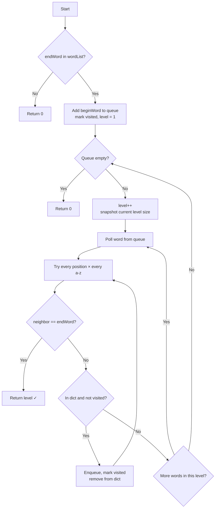

# Word Ladder — Medium
Problem Link: [LeetCode](https://leetcode.com/problems/word-ladder/description/)
Solved Date: 2026-02-27
Pattern Tag: bfs / shortest-path / graph-implicit
Review Date: 2026-03-21

## SRS Tracking
- Stage: 3
- Review Date: 2026-04-02
- Last Rating: Okay
- Review Count: 3
- Graduated: No

---

# Real World Analogy
—

## Core Insight
Treat each word as a graph node and a single-letter change as an edge — shortest transformation sequence = shortest path via BFS.

## Approach
Add beginWord to a queue and explore level by level. For each word, try replacing every character with 'a'-'z' to generate valid neighbors from the dictionary. The moment we generate endWord, we return the current level. Remove words from the dictionary as they're visited to avoid revisiting.

## Pseudocode
```
if endWord not in wordList → return 0
add beginWord to queue, mark visited
level = 1

while queue not empty:
    level++
    for each word in current level:
        for each position in word:
            for ch = 'a' to 'z':
                generate neighbor
                if neighbor == endWord → return level
                if neighbor in dict and not visited:
                    add to queue, mark visited, remove from dict

return 0
```

## Flowchart


## Boilerplate Template
```java
public int ladderLength(String beginWord, String endWord, List<String> wordList) {
    Set<String> dict = new HashSet<>(wordList);
    Set<String> visited = new HashSet<>();

    if (!dict.contains(endWord)) return 0;

    Queue<String> queue = new LinkedList<>();
    queue.add(beginWord);
    visited.add(beginWord); // guard against beginWord being in wordList
    int level = 1;

    while (!queue.isEmpty()) {
        int size = queue.size();
        level++;
        for (int i = 0; i < size; i++) {
            String curr = queue.poll();
            StringBuilder sb = new StringBuilder(curr);
            for (int pos = 0; pos < curr.length(); pos++) {
                char original = sb.charAt(pos);
                for (char ch = 'a'; ch <= 'z'; ch++) {
                    sb.setCharAt(pos, ch);
                    String nbr = sb.toString();
                    if (dict.contains(nbr)) {
                        if (nbr.equals(endWord)) return level;
                        if (!visited.contains(nbr)) {
                            visited.add(nbr);
                            queue.add(nbr);
                            dict.remove(nbr);
                        }
                    }
                }
                sb.setCharAt(pos, original);
            }
        }
    }
    return 0;
}
```

## Complexity
- Time: O(N × M²) — N words, each generating 26×M neighbors, each costing O(M) string creation
- Space: O(N × M) — dict, visited, and queue each store up to N words of length M

## Watch Out For
- `beginWord` must be added to `visited` at start — if it's in wordList, neighbor generation can re-enqueue it
- `dict.remove()` alone prevents cycles for all other words (visited is redundant but harmless)
- Don't check `curr == endWord` on dequeue — endWord is never enqueued, we return the moment it's generated as a neighbor

## Complete Code
```java
import java.util.*;

class Solution {
    public int ladderLength(String beginWord, String endWord, List<String> wordList) {
        Set<String> dict = new HashSet<>(wordList);
        Set<String> visited = new HashSet<>();

        if (!dict.contains(endWord)) return 0;

        Queue<String> queue = new LinkedList<>();
        queue.add(beginWord);
        visited.add(beginWord); // guard: beginWord may exist in wordList

        int level = 1;

        while (!queue.isEmpty()) {
            int levelSize = queue.size();
            level++;

            for (int i = 0; i < levelSize; i++) {
                String curr = queue.poll();
                StringBuilder sb = new StringBuilder(curr);

                for (int pos = 0; pos < curr.length(); pos++) {
                    char original = sb.charAt(pos);

                    for (char ch = 'a'; ch <= 'z'; ch++) {
                        sb.setCharAt(pos, ch);
                        String nbr = sb.toString();

                        if (dict.contains(nbr)) {
                            if (nbr.equals(endWord)) return level;
                            if (!visited.contains(nbr)) {
                                visited.add(nbr);
                                queue.add(nbr);
                                dict.remove(nbr);
                            }
                        }
                    }
                    sb.setCharAt(pos, original);
                }
            }
        }

        return 0;
    }
}
```

## Dry Run
```
beginWord = "hit", endWord = "cog"
wordList  = ["hot","dot","dog","lot","log","cog"]

Level 1: queue = [hit]
Level 2: process hit → generate hot → queue = [hot]
Level 3: process hot → generate dot, lot → queue = [dot, lot]
Level 4: process dot → generate dog
         process lot → generate log → queue = [dog, log]
Level 5: process dog → generate cog → cog == endWord → return 5 ✓
```

## Mental Model — Key decisions explained

```
┌─────────────────────────────────────┬─────────────────────────────────────────────────────────────┐
│ Decision                            │ Why                                                         │
├─────────────────────────────────────┼─────────────────────────────────────────────────────────────┤
│ Why level-order BFS?                │ We want shortest path — level = transformation count        │
│ Why remove from dict on visit?      │ Prevents revisiting the same word via a different path      │
│ Why check endWord as neighbor?      │ endWord is never enqueued — return the moment it's generated│
│ Why not DFS?                        │ DFS finds A path, not the SHORTEST path                     │
│ Why visited set + dict.remove()?    │ visited guards beginWord; dict.remove guards everything else│
└─────────────────────────────────────┴─────────────────────────────────────────────────────────────┘
```

